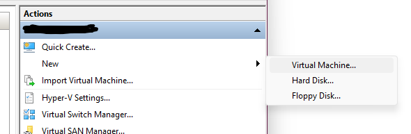
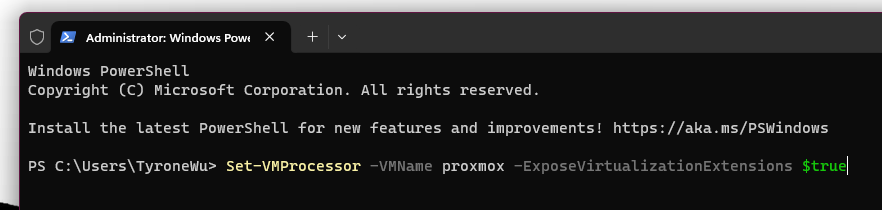
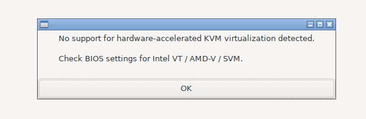
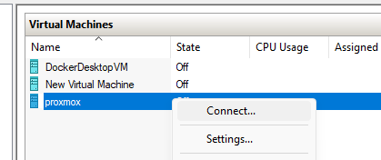
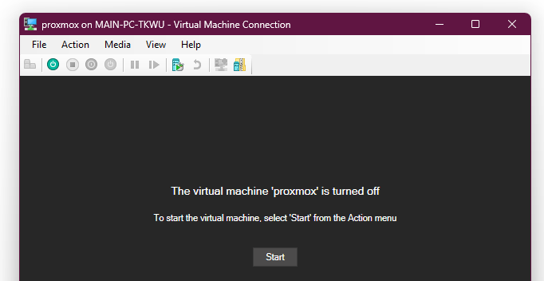
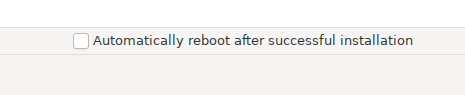
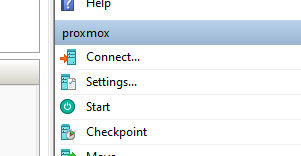
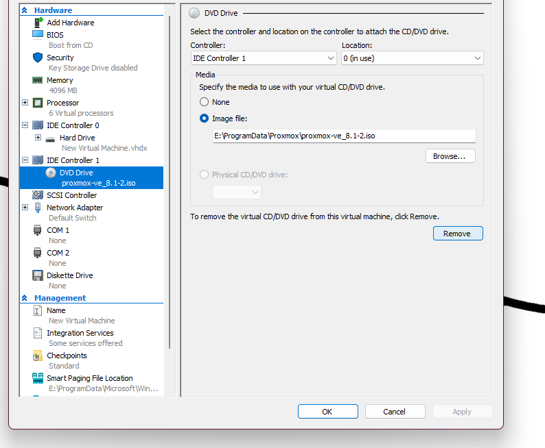
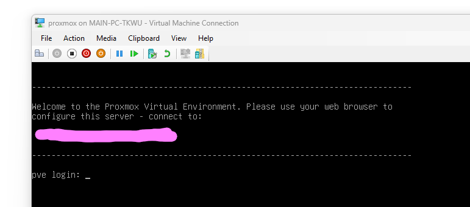

### Steps to install Proxmox VE on Hyper-V

Here are instructions for how I installed Proxmox onto Hyper-V on my Windows PC. Obviously, this is just for learning purposes and will not be running 24/7. 🙃🙃🙃

#### Prerequisite

Have or upgrade to Windows 11 for the [nested virtualization](https://learn.microsoft.com/en-us/virtualization/hyper-v-on-windows/user-guide/enable-nested-virtualization) feature.  
You will also need to [enable virtualization](https://support.microsoft.com/en-us/windows/enable-virtualization-on-windows-11-pcs-c5578302-6e43-4b4b-a449-8ced115f58e1) on Windows. 

#### Installation
1. Download the [Proxmox VE ISO](https://www.proxmox.com/en/downloads](https://www.proxmox.com/en/downloads/proxmox-virtual-environment/iso)https://www.proxmox.com/en/downloads/proxmox-virtual-environment/iso).

2. Open Hyper-V Manager, and select `New` > `Virtual Machine` on the right panel.

3. Configure the VM as you like (name, memory, storage, etc.), but make sure that Generation 1 is selected. For the network configuration, I chose `Default Switch`. Under `Connect Virtual Hard Disk` > `Installation Options`, select `Install an operating system from a bootable CD/DVD-ROM` > `Image file (.iso)` and browse to the Proxmox VE ISO file that you downloaded in part 1. 

Finally, select `Finish` to create the VM. 

4. Next, enable nested virtualization on the VM by opening Powershell with Admin privileges, and execute `Set-VMProcessor -VMName <VM-NAME> -ExposeVirtualizationExtensions $true`. Replace `<VM-NAME>` with the name of your VM. 

If you do not enable nested virtualization, you will be given this pop-up when starting the VM. 

5. To start the VM, select it under the `Virtual Machines` tab in Hyper-V Manager, right-click and select `Connect` which should bring up a window, and then select `Start`. 

6. The Proxmox VE Installation window should now appear like this. In this window, you can only use the arrow keys for navigation, enter to select, and esc to go back. Select `Install Proxmox VE (Graphical)`, and then go through the installer steps. I left most things as default, except for my `Time zone`, `Hostname (FQDN)`, and obviously my login credentials. 

7. Finally on the Summary window, uncheck `Automatically reboot after successful installation` (since we need to remove the ISO before we reboot), and select `Install`. 

8. After it finishes installing, the window should display `Installation successful!` along with the `Next steps`. Instead of immediately rebooting, we must first remove the Promox ISO or else rebooting will take us back to the installation menu. To do this, first turn off the VM by selecting it under `Virtual Machines` tab in Hyper-V Manager, right-clicking and selecting `Shut Down` or `Turn Off` (either works). 

9. While the VM is selected in Hyper-V Manager, select `Settings` on the lower right panel. 

On the settings window, nagivate to `IDE Controller 1` > `DVD Drive` and select `Remove`. 

Then select `Apply` and `Okay`.

10. Now start the VM like before in part 5, and you should be shown this window. 

Go to the displayed URL in your preferred web browser, and enter your login credentials that you configured from part 6 (just password). The `User name` is defaulted to be `root`. 

Congrats, you now have Proxmox installed on Hyper-V and the web dashboard up and running!!! ᕙ(^▿^-ᕙ)